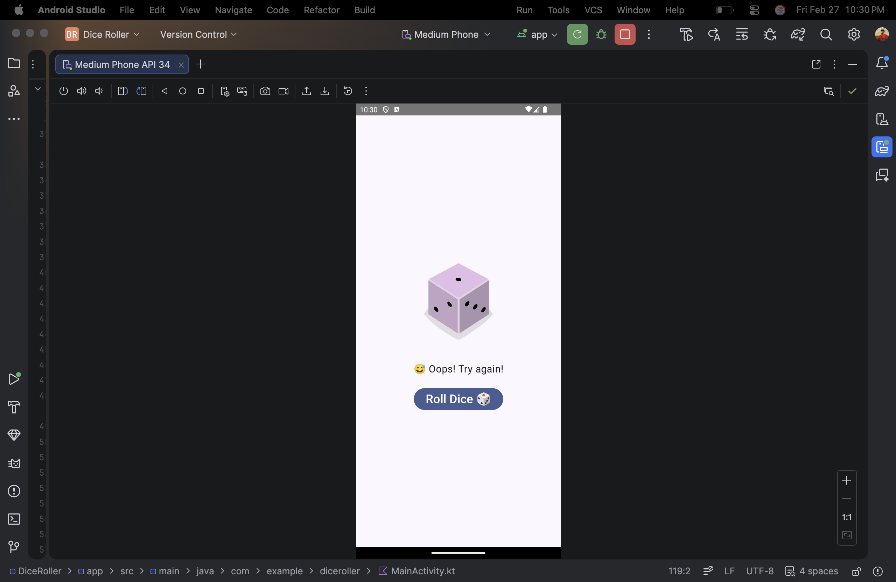
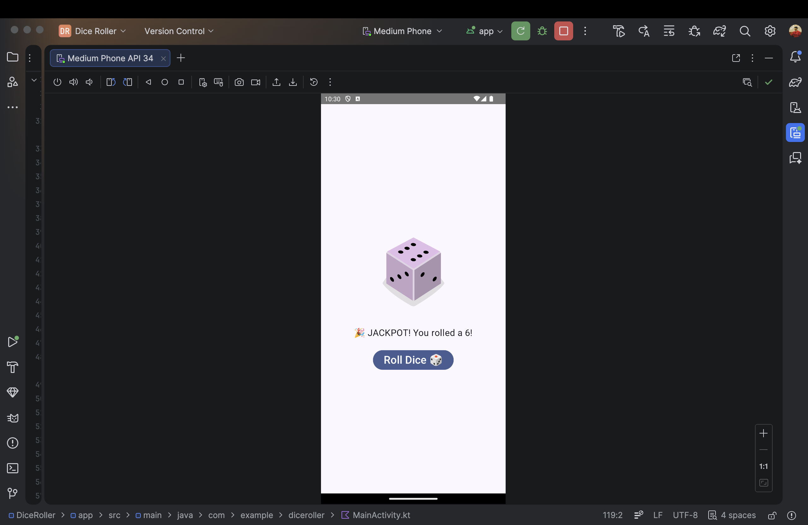

# 🎲 Dice Roller App – Jetpack Compose

A fun and interactive Dice Roller Android application built using **Kotlin** and **Jetpack Compose**.

This app simulates rolling a dice with animation effects and dynamic result messages.

---

## 🚀 Features

- 🎲 Random dice roll (1–6)
- ✨ Animated dice scaling effect
- 🎉 Special message for rolling 6
- 😅 Funny feedback for rolling 1
- 📱 Clean and responsive UI
- 🎨 Material 3 design

---

## 📱 UI Preview

### Main Screen

### Rolling State

### Result Screen

---

## 🛠 Tech Stack

- **Kotlin**
- **Jetpack Compose**
- **Material 3**
- **Android Studio**

---

## 🎯 Learning Outcomes

This project helped me understand:

- State management using `remember` and `mutableStateOf`
- Recomposition in Jetpack Compose
- Animations using `animateFloatAsState`
- Layout design using `Column`, `Spacer`, and `Modifier`
- Handling user interaction with Buttons

---

## 👨‍💻 Author

**Fahad Umar Farooq**  
Android Developer | Kotlin & Compose Learner 🚀

---

## ⭐ Future Improvements

- Add dice roll sound effect
- Add dark mode toggle
- Add roll counter history
- Add shake-to-roll feature
- Improve tablet responsiveness

---

### 🔥 Built as part of my Android + Jetpack Compose learning journey.
